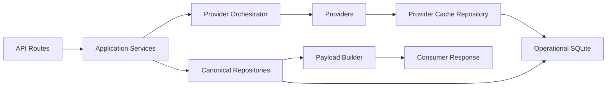

# Architecture

AI-MARKET-DATA-SERVICE is a data provider only. It does not contain trading logic.

## Composition Root

`app.main` owns FastAPI lifecycle and scheduler setup. Provider and service construction lives in `app.bootstrap.application.build_application_state`.

## Persistence

All application SQLite access is centralized under `app.infrastructure.persistence`.

- `database.py`: connection creation and health checks.
- `schema.py`: canonical schema and provider-cache schema.
- `migrations.py`: idempotent schema migrations and legacy `cache_entries` import.
- `provider_cache_repository.py`: provider cache repository.

Canonical repositories keep their public APIs but obtain connections through the persistence layer.

Default operational DB:

```env
AI_MARKET_CANONICAL_STORE_DB_PATH=./data/market_data_service.sqlite
AI_MARKET_PROVIDER_CACHE_DB_PATH=./data/market_data_service.sqlite
```

## Refresh Semantics

- `refresh=false`: no provider network calls; use DB/cache only.
- `refresh=auto`: DB/cache first, providers only when the data is missing or refresh is due.
- `refresh=force`: provider refresh is allowed and persisted; last-known-good data must not be overwritten by failures.

## Data Flow



## Data Ownership

| Data | Owner | Tables |
| --- | --- | --- |
| Raw provider response | Provider cache repository | `provider_cache_entries` |
| Provider rate-limit/circuit state | Provider cache repository | `provider_state` |
| Normalized macro fact | Market fact repository | `market_facts` |
| Economic event history | Market fact repository | `economic_events_history` |
| Deduplicated news | Market news repository | `market_news` |
| Provider diagnostics | Provider observation repository | `provider_observations` |
| Enrichment lifecycle | Enrichment run repository | `enrichment_runs` |

## Operational Scripts

- `scripts/migrate_persistence.py`
- `scripts/backup_database.py`
- `scripts/reset_database.py`
- `scripts/validate_database.py`

Use `--dry-run` on migration/reset checks before applying destructive operations.
